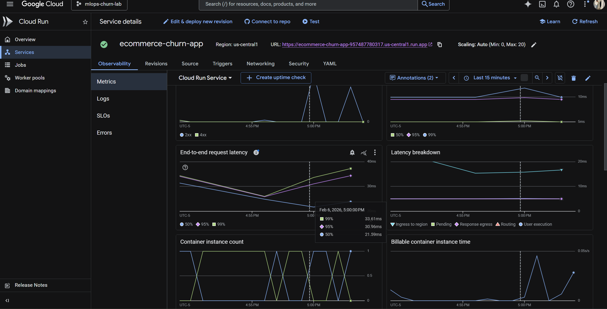

# 🛒 E-Commerce Customer Churn Prediction

A production-ready machine learning system that predicts customer churn for e-commerce businesses. Built with XGBoost, Flask API, Streamlit dashboard, and deployed on Google Cloud Run.


## 🎯 Project Overview

Customer churn is a critical business problem — acquiring new customers costs 5-25x more than retaining existing ones. This project provides:

- **ML Model**: XGBoost classifier with 92% accuracy
- **REST API**: Flask-based API deployed on GCP Cloud Run
- **Dashboard**: Interactive Streamlit interface for business users
- **Recommendations**: Automated retention strategy suggestions

### 🔗 Live Demo

- **API**: https://ecommerce-churn-app-957487780317.us-central1.run.app
- **Health Check**: https://ecommerce-churn-app-957487780317.us-central1.run.app/health

---
## 📸 Screenshots                   

### Dashboard


### Churn Prediction (High Risk)


### No Churn Prediction (Low Risk)


### Cloud Monitoring (GCP)



## 📊 Model Performance

| Metric | Score |
|--------|-------|
| Accuracy | 92% |
| Precision | 88% |
| Recall | 75% |
| F1-Score | 81% |
| ROC-AUC | 94% |

---

## 🔍 Key Findings

| Risk Factor | Impact |
|-------------|--------|
| **Tenure < 6 months** | 3x higher churn risk |
| **Has Complaints** | Strongest churn predictor |
| **Satisfaction Score ≤ 2** | 2.5x higher churn risk |
| **Inactive > 30 days** | High disengagement signal |
| **Low Cashback** | Indicates low engagement |

---

## 🛠️ Tech Stack

| Component | Technology |
|-----------|------------|
| ML Model | XGBoost, Scikit-learn |
| Data Processing | Pandas, NumPy |
| API | Flask |
| Frontend | Streamlit |
| Containerization | Docker |
| Cloud | GCP Cloud Run, Cloud Build |
| Version Control | Git, GitHub |

---

## 📁 Project Structure

```
ecommerce-churn-prediction/
├── model/
│   ├── churn_model.pkl          # Trained model + encoders
│   ├── model_metadata.json      # Model performance metrics
│   ├── model_comparison.csv     # All models comparison
│   └── feature_importance.csv   # Feature rankings
├── data/
│   └── ecommerce_churn.csv      # Dataset (not in repo)
├── train.py                     # Training pipeline
├── predict.py                   # Prediction module
├── main.py                      # Flask API
├── streamlit_app.py             # Streamlit dashboard
├── requirements.txt             # Dependencies
├── Dockerfile                   # Container config
├── .gitignore
└── README.md
```

---

## 🚀 Quick Start

### Prerequisites

- Python 3.10+
- Git

### Local Development

```bash
# Clone repository
git clone https://github.com/kizamehoshigaki/ecommerce-churn-prediction.git
cd ecommerce-churn-prediction

# Install dependencies
pip install -r requirements.txt

# Download dataset from Kaggle and save to data/ecommerce_churn.csv
# https://www.kaggle.com/datasets/ankitverma2010/ecommerce-customer-churn-analysis-and-prediction

# Train the model
python train.py

# Run API
python main.py

# Run Streamlit (new terminal)
streamlit run streamlit_app.py
```

### Docker

```bash
# Build image
docker build -t ecommerce-churn-app .

# Run container
docker run -p 8080:8080 ecommerce-churn-app
```

---

## 📡 API Endpoints

| Endpoint | Method | Description |
|----------|--------|-------------|
| `/` | GET | API documentation |
| `/health` | GET | Health check |
| `/predict` | POST | Predict churn |
| `/model/info` | GET | Model metadata |
| `/model/valid-values` | GET | Valid input values |

### Example Request

```bash
curl -X POST https://ecommerce-churn-app-957487780317.us-central1.run.app/predict \
  -H "Content-Type: application/json" \
  -d '{
    "tenure": 5,
    "warehouse_to_home": 25,
    "hour_spend_on_app": 2.0,
    "number_of_device_registered": 3,
    "satisfaction_score": 2,
    "number_of_address": 4,
    "complain": 1,
    "order_amount_hike": 15,
    "coupon_used": 1,
    "order_count": 3,
    "day_since_last_order": 15,
    "cashback_amount": 120,
    "city_tier": 1,
    "preferred_login_device": "Mobile Phone",
    "preferred_payment_mode": "Credit Card",
    "gender": "Male",
    "prefered_order_cat": "Mobile Phone",
    "marital_status": "Single"
  }'
```

### Example Response

```json
{
  "prediction": "Churn",
  "churn_probability": 0.7342,
  "retention_probability": 0.2658,
  "risk_level": "High",
  "risk_factors": [
    "New customer (tenure: 5 months) - highest churn risk",
    "Has filed complaints - strong churn indicator",
    "Low satisfaction score (2/5)"
  ],
  "recommendations": [
    "Implement onboarding program with early engagement incentives",
    "Prioritize complaint resolution and follow-up within 24 hours",
    "Offer personalized discount or loyalty reward"
  ]
}
```

---

## ☁️ GCP Deployment

### Prerequisites

- Google Cloud account
- gcloud CLI installed
- Project with billing enabled

### Deploy Steps

```bash
# Authenticate
gcloud auth login

# Set project
gcloud config set project YOUR_PROJECT_ID

# Enable APIs
gcloud services enable cloudbuild.googleapis.com run.googleapis.com

# Build and push
gcloud builds submit --tag gcr.io/YOUR_PROJECT_ID/ecommerce-churn-app

# Deploy
gcloud run deploy ecommerce-churn-app \
  --image gcr.io/YOUR_PROJECT_ID/ecommerce-churn-app \
  --platform managed \
  --region us-central1 \
  --port 8080 \
  --allow-unauthenticated
```

---

## 📈 Features Used

### Numerical Features (13)

| Feature | Description |
|---------|-------------|
| Tenure | Months with company |
| WarehouseToHome | Distance in km |
| HourSpendOnApp | Daily app usage |
| NumberOfDeviceRegistered | Registered devices |
| SatisfactionScore | Rating 1-5 |
| NumberOfAddress | Saved addresses |
| Complain | Has complained (0/1) |
| OrderAmountHikeFromlastYear | % increase |
| CouponUsed | Coupons redeemed |
| OrderCount | Total orders |
| DaySinceLastOrder | Days inactive |
| CashbackAmount | Total cashback |
| CityTier | City tier (1/2/3) |

### Categorical Features (5)

| Feature | Values |
|---------|--------|
| PreferredLoginDevice | Mobile Phone, Computer, Phone |
| PreferredPaymentMode | Credit Card, Debit Card, UPI, COD, E wallet |
| Gender | Male, Female |
| PreferedOrderCat | Laptop & Accessory, Mobile, Fashion, Grocery, Others |
| MaritalStatus | Single, Married, Divorced |

---

## 🧠 Model Training Pipeline

1. **Data Loading** → Kaggle E-Commerce Churn Dataset
2. **Preprocessing** → Handle nulls, encode categoricals, stratified split
3. **Model Comparison** → Logistic Regression, Random Forest, Gradient Boosting, XGBoost
4. **Class Imbalance** → Handled with class_weight / scale_pos_weight
5. **Hyperparameter Tuning** → GridSearchCV with 5-fold CV
6. **Save Artifacts** → Model, encoders, metadata

---

## 👨‍💻 Author

**Aaditya Krishna**  
MS Data Analytics Engineering  
Northeastern University

- GitHub: [@kizamehoshigaki](https://github.com/kizamehoshigaki)
- LinkedIn: [Aaditya Krishna](https://linkedin.com/in/aadityakrishna)

---
## 📄 License

This is a personal project built to demonstrate end-to-end MLOps skills including model development, API deployment, and cloud infrastructure.